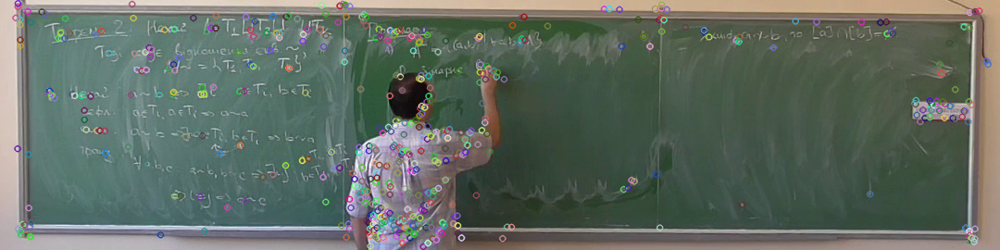
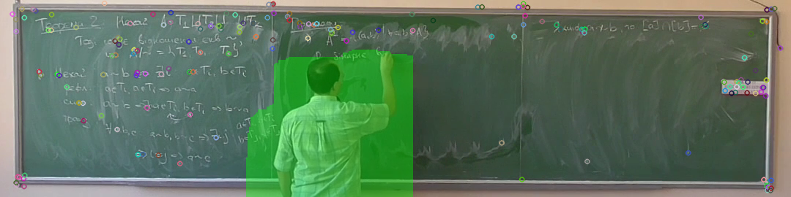
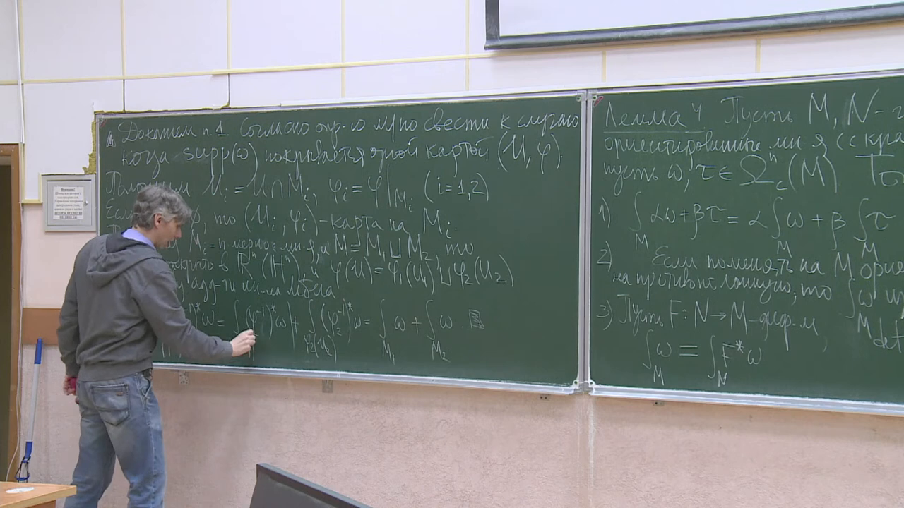
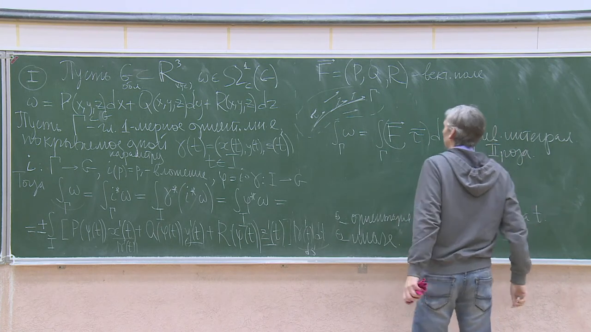
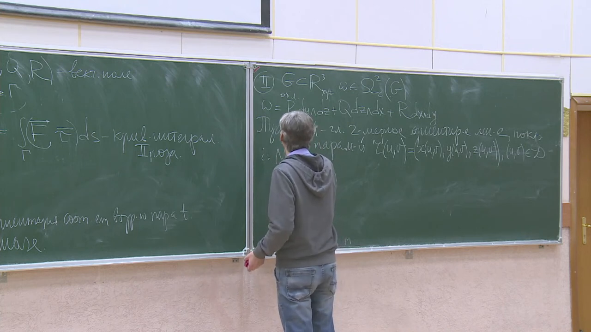

# Master Thesis - Creating slides from video lecture

## Structure

- `presentation/` — presentation sources and build script
- `thesis/` — master thesis sources and build scripts

## Abstract
The aim of this work is to create an algorithm for obtaining panorama slides
without a teacher from a video lecture recorded by a camera that may move or
shake.

## Summary

This thesis studies how to turn a board lecture video into a clean slide deck.
The core idea is to process consecutive frames, detect the teacher or other
moving objects, stitch the remaining board content into a panorama, and create
new slides only when enough visual change has appeared.

The implementation combines:

- SIFT for keypoint detection and frame matching
- homography for panorama construction
- Boykov-Kolmogorov max-flow for motion-mask generation
- convolutional neural networks for person detection
- denoising and binarization for cleaner slide output

## Example Results

| Key points                                                   |
|--------------------------------------------------------------|
|                          |

| Key points    after removal                                  |
| ------------------------------------------------------------ |
|                |

| Left part                                      |                              Center part                              | Right part                                      |
|------------------------------------------------|:---------------------------------------------------------------------:|-------------------------------------------------|
|  |                       |  |

| Panorama                                                    |
|-------------------------------------------------------------|
|  |

## Thesis Conclusions

- The work produced an end-to-end algorithm for creating panorama slides
  without the lecturer.
- None of the reviewed analogs combined all the capabilities implemented in
  this thesis.
- YOLO-family models, especially `YOLOv5n`, showed the best practical tradeoff
  for lecturer removal.
- Further improvements suggested in the thesis include board detection,
  vectorized board content extraction, and GPU acceleration.

## Supervisor
- Valerii Krygin ([@definability](https://github.com/definability))

## Author
- Maksym Shylo ([@maksymshylo](https://github.com/maksymshylo))
