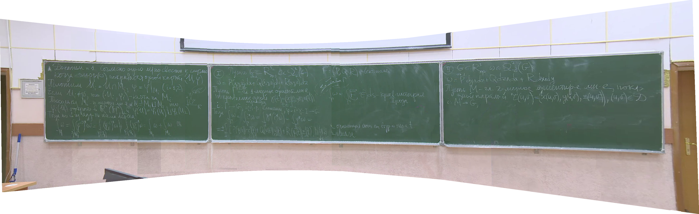

# Master Thesis - Creating slides from video lecture

## Abstract
The aim of this work is to create an algorithm for obtaining panorama slides
without a teacher from a video lecture recorded by a camera that may move or
shake.

## Summary

This thesis studies how to turn a board lecture video into a clean slide deck.
The core idea is to process consecutive frames, detect the teacher or other
moving objects, stitch the remaining board content into a panorama, and create
new slides only when enough visual change has appeared.

The implementation combines:

- SIFT for keypoint detection and frame matching
- homography for panorama construction
- Boykov-Kolmogorov max-flow for motion-mask generation
- convolutional neural networks for person detection
- denoising and binarization for cleaner slide output

## Example Results

Panorama slides produced from lecture videos:



## Thesis Conclusions

- The work produced an end-to-end algorithm for creating panorama slides
  without the lecturer.
- None of the reviewed analogs combined all the capabilities implemented in
  this thesis.
- YOLO-family models, especially `YOLOv5n`, showed the best practical tradeoff
  for lecturer removal.
- Further improvements suggested in the thesis include board detection,
  vectorized board content extraction, and GPU acceleration.

## Repository Layout

- `thesis/` — master thesis sources and build scripts
- `presentation/` — presentation sources and build script
- `Dockerfile` — TeX Live build environment

## Build Prerequisites

- Docker

## Build Docker Image

```bash
docker build -t thesis-builder .
```

## Build Thesis

Run the following commands from inside `thesis/`.

Fast build without bibliography:

```bash
docker run --rm \
  -u "$(id -u):$(id -g)" \
  -v "$(pwd):/work/thesis" \
  thesis-builder \
  bash -lc 'cd /work/thesis && bash build.sh'
```

Full build with bibliography:

```bash
docker run --rm \
  -u "$(id -u):$(id -g)" \
  -v "$(pwd):/work/thesis" \
  thesis-builder \
  bash -lc 'cd /work/thesis && bash build_with_bib.sh'
```

Output PDF:

- `thesis/index.pdf`

### Build Thesis with Times New Roman font

By default, the thesis uses `XITS`. 
To build with the operating system's
`Times New Roman`, make sure it's installed:

- **macOS**: usually available at
  `/System/Library/Fonts/Supplemental/Times New Roman.ttf`
- **Windows**: usually available at
  `C:\Windows\Fonts\times.ttf`
- **Linux**: install a package that provides Microsoft core fonts, for example
  `ttf-mscorefonts-installer` on Ubuntu/Debian-based systems

Copy the required font files into the project-local `.fonts/` directory first.

```bash
mkdir -p .fonts
cp "/System/Library/Fonts/Supplemental/Times New Roman.ttf" .fonts/
cp "/System/Library/Fonts/Supplemental/Times New Roman Bold.ttf" .fonts/
cp "/System/Library/Fonts/Supplemental/Times New Roman Italic.ttf" .fonts/
cp "/System/Library/Fonts/Supplemental/Times New Roman Bold Italic.ttf" .fonts/
```

Build thesis with `Times New Roman`:
```
docker run --rm \
  -u "$(id -u):$(id -g)" \
  -v "$(pwd):/work/thesis" \
  -v "$(pwd)/.fonts:/usr/local/share/fonts:ro" \
  thesis-builder \
  bash -lc 'cd /work/thesis && bash build_with_bib.sh --times'
```

## Build Presentation

Run the following command from inside `presentation/`.

```bash
docker run --rm \
  -u "$(id -u):$(id -g)" \
  -v "$(pwd):/work/presentation" \
  thesis-builder \
  bash -lc 'cd /work/presentation && bash build.sh'
```

Output PDF:

- `presentation/index.pdf`

## Clean Thesis Build Artifacts

```bash
cd thesis
bash clean.sh
```

To also remove the generated PDF:

```bash
cd thesis
bash clean.sh --full
```

## Supervisor
- Valerii Krygin ([@definability](https://github.com/definability))

## Author
- Maksym Shylo ([@maksymshylo](https://github.com/maksymshylo))
